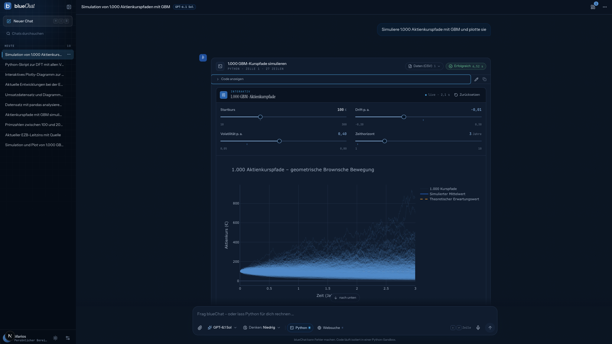
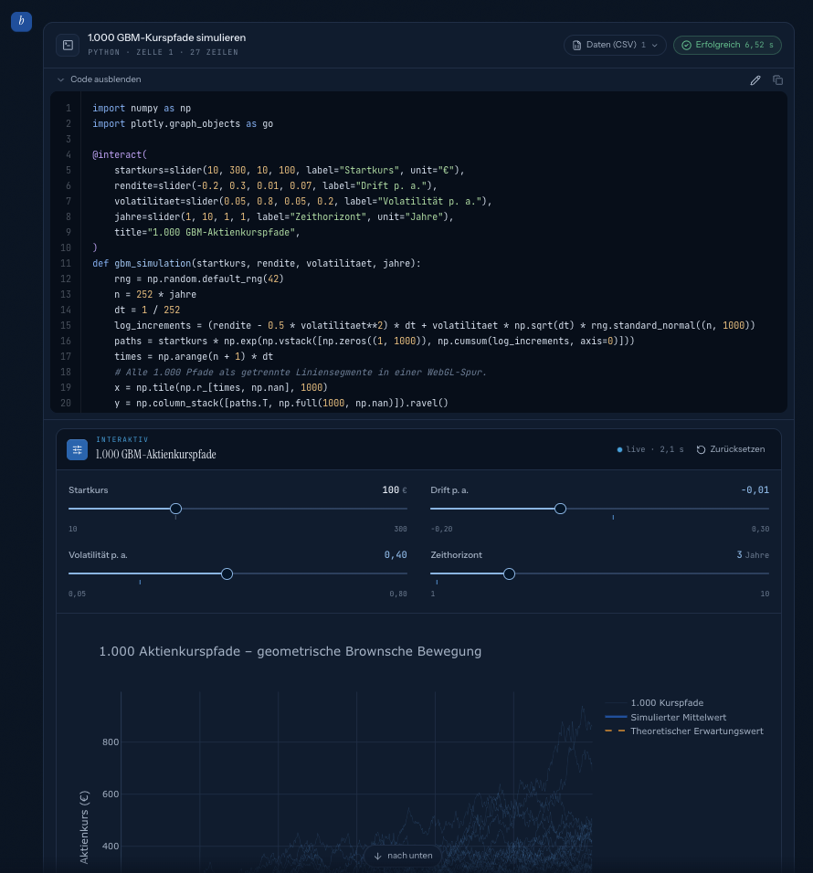
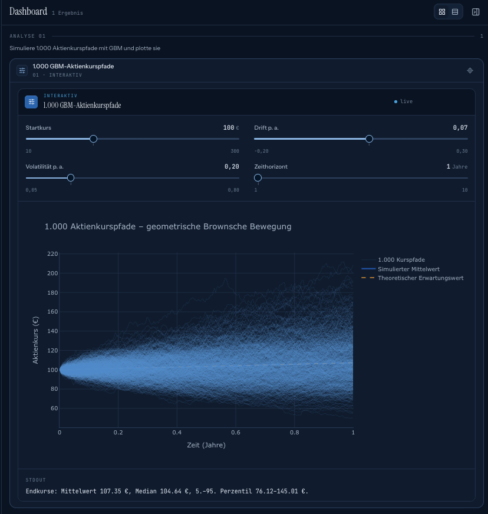

<p align="center">
  
</p>

<p align="center">
  <strong>ChatGPT-ähnliches Chat-Interface mit Python-Code-Interpreter, Websuche, Modell- und Denkstufen-Auswahl.</strong>
</p>

<p align="center">
  
  
  
  
  
  
  
</p>

<p align="center">
  <a href="#-schnellstart">Schnellstart</a> ·
  <a href="#-funktionen">Funktionen</a> ·
  <a href="#-interaktive-regler">Regler</a> ·
  <a href="#-analyse-modus--dashboard">Dashboard</a> ·
  <a href="#-projektstruktur">Struktur</a>
</p>

<br>

<p align="center">
  
</p>

<table>
  <tr>
    <td align="center" width="25%"><b>6</b><br><sub>Modelle wählbar</sub></td>
    <td align="center" width="25%"><b>1 Kernel</b><br><sub>pro Chat, zustandsbehaftet</sub></td>
    <td align="center" width="25%"><b>180 s</b><br><sub>max. Laufzeit pro Zelle</sub></td>
    <td align="center" width="25%"><b>50 MB</b><br><sub>max. Datei-Upload</sub></td>
  </tr>
</table>

## 🚀 Schnellstart

**1.** OpenAI-Key in `.env` eintragen (Vorlage: `.env.example`):

```
OPENAI_API_KEY=sk-...
```

**2.** Alles starten (DB, Python-Sandbox und Next.js im Dev-Modus):

```bash
docker compose up
```

**3.** Öffnen: **http://localhost:3000**

<details>
<summary><b>Alternative:</b> Frontend lokal, Infrastruktur in Docker</summary>
<br>

```bash
docker compose up -d db sandbox
npm install
npm run dev
```

</details>

## ✨ Funktionen

<table>
  <tr>
    <td width="50%" valign="top">
      <h4>💬 Chat</h4>
      <ul>
        <li>Streaming, Markdown, Code-Highlighting, LaTeX</li>
        <li>Chatverlauf mit Umbenennen, Löschen, Suche und automatischen Titeln</li>
        <li><b>Modell</b> und <b>Denkstufe</b> pro Chat; der Gedankengang wird als Zusammenfassung angezeigt</li>
        <li><b>Websuche</b> über OpenAI mit Quellenangaben</li>
        <li><b>Spracheingabe</b> per Mikrofon (bis 25 MB pro Aufnahme)</li>
        <li>Systemprompt und Standardwerte unter <i>Einstellungen</i></li>
        <li>Hell/Dunkel-Modus</li>
      </ul>
    </td>
    <td width="50%" valign="top">
      <h4>🐍 Python-Code-Interpreter</h4>
      <ul>
        <li>Jupyter-Kernel pro Chat: Variablen bleiben erhalten</li>
        <li>Ausgaben: stdout/stderr, Plots, Tabellen, Plotly-Charts, Tracebacks, Dateien</li>
        <li><b>Code bearbeiten</b> direkt in der Karte und neu ausführen (<kbd>Strg/⌘</kbd> + <kbd>Enter</kbd>)</li>
        <li><b>CSV-Export</b> hinter jeder Tabelle und jedem Diagramm</li>
        <li><b>Datei-Upload</b> per Büroklammer oder Drag &amp; Drop</li>
        <li><b>Jupyter-Notebook-Export</b> (<code>.ipynb</code>) des ganzen Chats</li>
      </ul>
    </td>
  </tr>
</table>

### 🎚️ Interaktive Regler

Simulationen können Regler anbieten (`@interact` mit `slider`, `select`, `checkbox`). Verschiebt man einen Regler, läuft nur die Funktion im Kernel neu und das Diagramm aktualisiert sich **ohne neue Chat-Nachricht**. Im Beispiel dauert ein Durchlauf mit 1.000 Pfaden etwa 2 s.

### 📊 Analyse-Modus & Dashboard

Bei Datei-Analysen arbeitet das Modell einen sichtbaren **Plan mit Häkchen** ab. Alle Diagramme, Tabellen und Widgets erscheinen zusätzlich im **Dashboard-Panel** rechts:
- Raster- oder Listenansicht, Breite verstellbar
- Ein Klick springt zur zugehörigen Zelle
- Das Panel öffnet sich automatisch ab der zweiten Grafik einer Antwort

<table>
  <tr>
    <td width="50%" valign="top" align="center">
      <br>
      <sub><b>Python-Zelle</b>: Code, Regler und Plot in einer Karte</sub>
    </td>
    <td width="50%" valign="top" align="center">
      <br>
      <sub><b>Dashboard</b>: 1.000 GBM-Pfade (100 €, Drift 7 %, Vol. 20 %, 1 Jahr). Endkurse im Mittel 107,35 €, 5.–95. Perzentil 76,12–145,01 €</sub>
    </td>
  </tr>
</table>

## 🧱 Tech-Stack

| Bereich | Technik |
|---|---|
| Frontend & Backend | Next.js 16.3 (App Router), React 19.2, Tailwind CSS v4, AI SDK v7 + OpenAI (Responses API, Streaming) |
| Datenbank | PostgreSQL 17 (Docker) für Chats, Nachrichten und Einstellungen |
| Python-Sandbox | FastAPI + Jupyter-Kernel (Python 3.12) mit numpy, pandas, matplotlib, seaborn, scipy, scikit-learn, statsmodels, plotly, sympy, openpyxl … |

## 🗂️ Projektstruktur

<details>
<summary>Verzeichnisse anzeigen</summary>
<br>

```
app/                 Seiten (/, /c/[id]) und API-Routen (app/api/*)
components/ui        wiederverwendbare UI-Primitive (Button, Dialog, DropdownMenu, Switch …)
components/shell     Sidebar, Einstellungen, Health-Banner
components/chat      Chat, Composer, Modell-/Denkstufen-/Tool-Auswahl, Spracheingabe
components/messages  Nachrichtendarstellung inkl. Python-Ergebnissen und Reglern
components/dashboard Dashboard-Panel
lib/                 Typen (types.ts), Modellkatalog (models.ts), Server-Logik (lib/server)
sandbox/             Python-Sandbox (FastAPI + Jupyter-Kernel)
db/init.sql          Datenbankschema
screenshots/         Screenshots und Banner für diese README
```

</details>

- Die Modellliste steht in `lib/models.ts`. `/api/models` zeigt nur die Modelle, die mit dem hinterlegten Key verfügbar sind.
- `/dev/messages` zeigt eine Vorschau aller Nachrichtentypen mit Mock-Daten.

<br>

<p align="center">
  <br>
  <sub>Entwickelt von <b>Marios Tzialidis</b></sub>
</p>